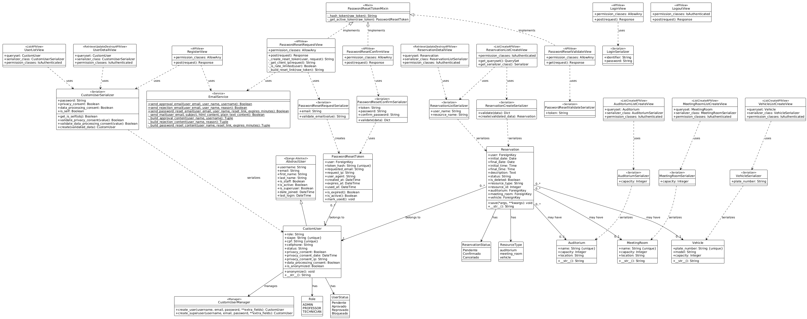
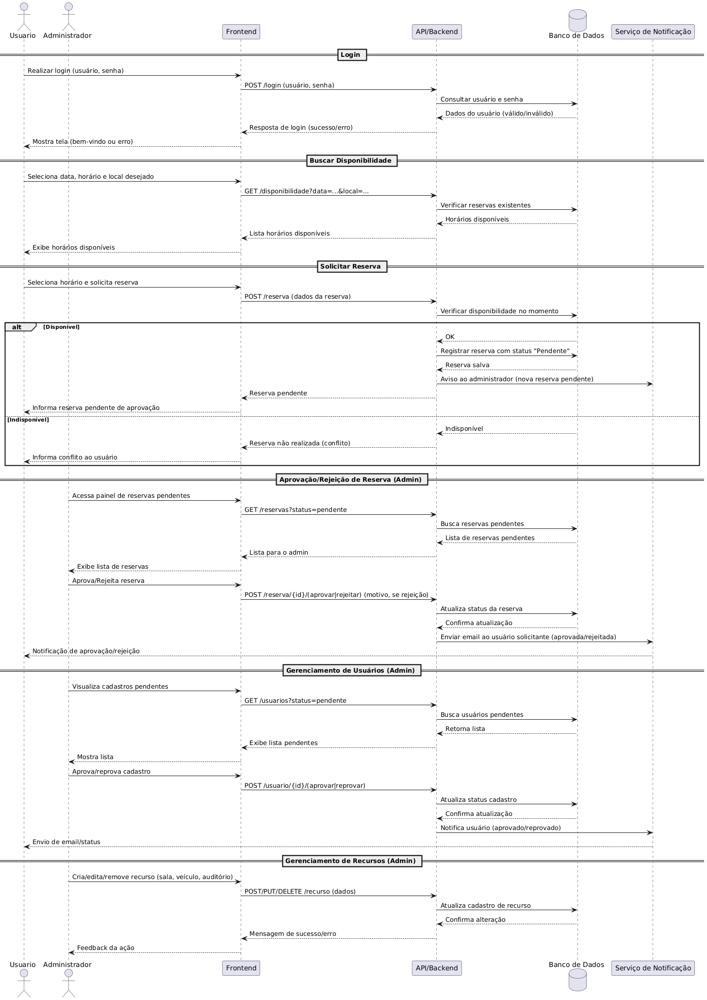

# Relatório de Modelagem - Sistema ReservaUFAM

Este documento apresenta a modelagem estrutural e comportamental do sistema **ReservaUFAM**, desenvolvida como parte da segunda etapa do Trabalho Prático 5 de Manutenção e Integração de Software.

A modelagem tem como objetivo representar formalmente a organização interna do sistema e como seus componentes interagem para realizar as funcionalidades principais, servindo como documentação técnica para futuras manutenções e evoluções.

---

## 1. Modelagem Estrutural: Diagrama de Classes

Para representar a estrutura estática do sistema, foi utilizado o **Diagrama de Classes da UML (Unified Modeling Language)**. Este diagrama evidencia os principais "blocos de construção" do sistema (classes), seus atributos, métodos essenciais e, principalmente, os relacionamentos entre eles (como associações, heranças e dependências).

Ele reflete a estrutura do domínio da aplicação conforme implementado no backend (Django Models) e utilizado nas regras de negócio.

### Diagrama de Classes do Domínio

  
  
<em>Figura 1: Diagrama de Classes do Domínio</em>

### Descrição dos Principais Elementos

O diagrama acima destaca as seguintes estruturas centrais:

* **`CustomUser`:** Representa os usuários do sistema, estendendo o modelo padrão para incluir informações específicas como SIAPE, CPF e o papel (Role) do usuário (Administrador ou Comum).
* **`Resource` (e suas subclasses):** Uma estrutura de herança que representa os recursos reserváveis. `Resource` funciona como uma classe base (abstrata ou conceitual) que define características comuns (como capacidade), enquanto `Auditorium`, `MeetingRoom` e `Vehicle` são as especializações concretas.
* **`Reservation`:** A classe central que conecta um usuário a um recurso em um determinado período de tempo. Ela gerencia o status da solicitação (Pendente, Aprovado, etc.) e armazena as datas e horários de início e fim. O relacionamento é de muitos-para-um em relação ao usuário (um usuário pode ter várias reservas).

---

## 2. Modelagem Comportamental: Diagrama de Sequência

Para representar a modelagem comportamental (interacional), foi utilizado um **Diagrama de Sequência da UML**. Este diagrama foca na troca de mensagens entre os diferentes objetos e componentes do sistema ao longo do tempo.

Ele é fundamental para entender o fluxo de execução das funcionalidades principais, desde a ação inicial dos usuários na interface até a persistência dos dados no banco.

O diagrama abaixo ilustra os fluxos dos cenários mais críticos do sistema: **Login**, **Busca de Disponibilidade**, **Solicitação de Reserva** e os processos administrativos de **Aprovação/Rejeição de Reserva**, **Gerenciamento de Usuários** e **Gerenciamento de Recursos**.

### Diagrama de Sequência dos Fluxos Principais

  
  
<em>Figura 2: Diagrama de Sequência dos Fluxos Principais</em>

### Descrição dos Fluxos Representados

O diagrama consolida as interações entre os atores (Usuário, Administrador), o Frontend, a API/Backend, o Banco de Dados e o Serviço de Notificação:

1.  **Login:** O usuário fornece credenciais, o backend as valida no banco de dados e retorna uma resposta de sucesso ou erro para o frontend.
2.  **Buscar Disponibilidade:** O usuário seleciona parâmetros de busca (data, local) no frontend. O backend consulta o banco de dados para verificar reservas existentes e retorna a lista de horários disponíveis.
3.  **Solicitar Reserva:** O usuário escolhe um horário e envia a solicitação. O backend realiza uma verificação crítica de disponibilidade no momento exato da solicitação. Se disponível, a reserva é salva com status "Pendente" e o administrador é notificado. Se houver conflito, o usuário é informado.
4.  **Aprovação/Rejeição de Reserva (Admin):** O administrador visualiza a lista de reservas pendentes e decide aprovar ou rejeitar. O backend atualiza o status no banco de dados e o serviço de notificação envia um e-mail ao usuário solicitante com o resultado.
5.  **Gerenciamento de Usuários (Admin):** Similar ao fluxo de reservas, o administrador visualiza cadastros pendentes e os aprova ou reprova, com atualização no banco e notificação via e-mail.
6.  **Gerenciamento de Recursos (Admin):** O administrador realiza operações de CRUD (Criar, Ler, Atualizar, Deletar) sobre os recursos (salas, veículos, etc.), e o backend persiste essas alterações no banco de dados.