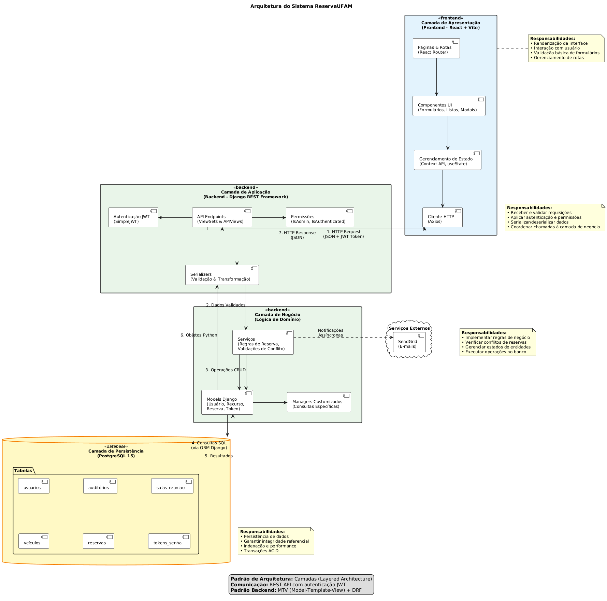
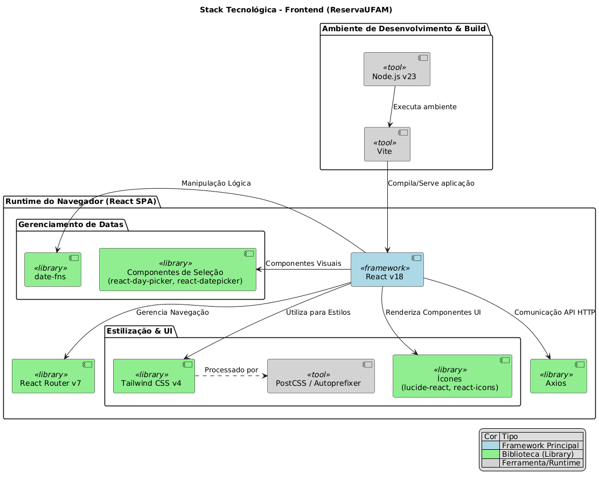
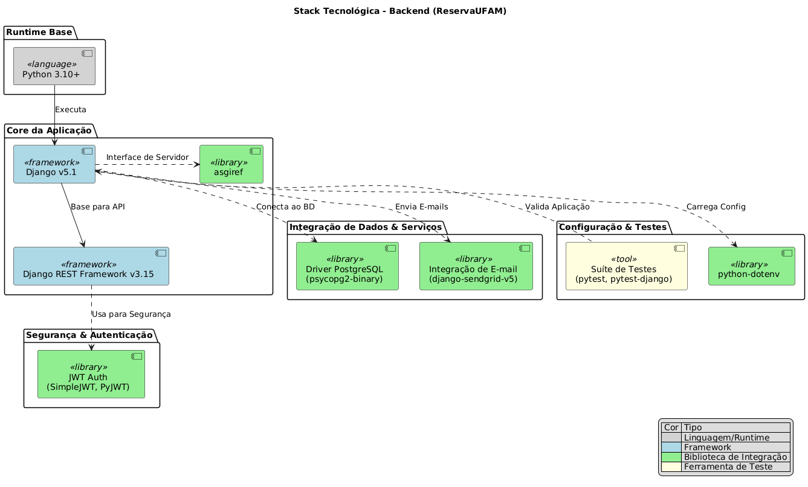
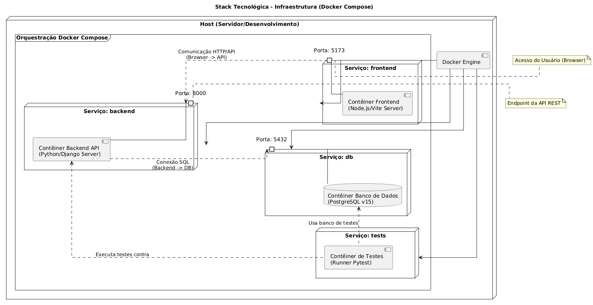

# Relatório de Engenharia Reversa - Sistema ReservaUFAM

Este documento consolida os resultados da engenharia reversa aplicada ao sistema **ReservaUFAM**, cobrindo os aspectos de requisitos funcionais, modelagem estrutural e comportamental, padrão arquitetural e stack tecnológica. A análise foi realizada como parte da disciplina de Manutenção e Integração de Software.

---

## 1. Requisitos Funcionais (Histórias de Usuário)

Esta seção documenta as funcionalidades principais do sistema na perspectiva dos diferentes usuários, extraídas da análise da interface e do fluxo da aplicação.

### H1 - Cadastro de Usuário
* **Como** visitante,
* **Quero** realizar meu cadastro,
* **Para** obter acesso às funcionalidades do sistema.

**Critérios de Aceitação:**
* O sistema deve permitir o cadastro de novos usuários com todos os campos obrigatórios preenchidos.
* O sistema deve validar o formato de todos os campos antes de submeter o formulário.
* O sistema deve exigir o aceite explícito dos termos de privacidade e processamento de dados (LGPD).
* O sistema deve criar o usuário com status "Pendente" por padrão.
* O sistema deve registrar a data, hora e IP do consentimento LGPD.
* O sistema deve exibir mensagem de sucesso informando que o cadastro aguarda aprovação.
* O sistema deve redirecionar o usuário para a página inicial após 5 segundos.

**Regras de Negócio:**
* **Campos Obrigatórios e Formatos:** Nome e Sobrenome (mín. 2 letras), Nome de usuário (mín. 3 carac., único), SIAPE (7 dígitos, único), CPF (11 dígitos, único), E-mail (válido, único), Cargo (PROFESSOR ou TÉCNICO), Telefone (11 dígitos), Senha (mín. 8 carac., forte), Confirmação de senha (igual à senha).
* **LGPD:** Dois checkboxes obrigatórios (Política de Privacidade e Processamento de Dados). O sistema registra automaticamente os metadados do consentimento.
* **Status:** Usuário criado como "Pendente".
* **Notificação:** Usuário recebe e-mail após aprovação/reprovação pelo administrador.

  
  
<em>Figura 1: Tela de Cadastro</em>

---

### H2 - Login no Sistema
* **Como** usuário,
* **Quero** fazer login,
* **Para** acessar o sistema.

**Critérios de Aceitação:**
* O sistema deve permitir login usando nome de usuário ou e-mail como identificador.
* O sistema deve validar credenciais (identificador + senha).
* O sistema deve verificar se o usuário está aprovado antes de permitir login.
* O sistema deve verificar se o usuário não está bloqueado.
* O sistema deve gerar tokens JWT (access e refresh) após login bem-sucedido.
* O sistema deve retornar dados do usuário autenticado.
* O sistema deve armazenar o token de acesso no localStorage do navegador.
* O sistema deve redirecionar o usuário para a página inicial após login bem-sucedido.

**Regras de Negócio:**
* **Identificador:** Aceita username ou e-mail.
* **Status da Conta:** Login permitido apenas para status "Aprovado". Usuários "Pendente" ou "Bloqueado" recebem mensagens de erro específicas.
* **Autenticação:** Utiliza JWT. A sessão é mantida via token no localStorage, enviado em todas as requisições autenticadas.

  
  
<em>Figura 2: Tela de Login</em>

---

### H3 – Escolha de Tema (Claro/Escuro)
* **Como** usuário,
* **Quero** escolher entre tema claro ou escuro,
* **Para** usar o sistema de forma mais confortável.

**Critérios de Aceitação:**
* O sistema deve oferecer a opção de escolher entre tema claro e escuro.
* A mudança de tema deve ser imediata.
* A preferência deve ser mantida em sessões futuras.

**Regras de Negócio:**
* **Padrão:** Tema claro para novos usuários.
* **Alternância:** Permite troca livre entre os temas.

---

### H4 — Atalhos na Página Inicial (Usuário Comum)
* **Como** usuário,
* **Quero** acessar atalhos rápidos na página inicial,
* **Para** navegar para as principais funcionalidades.

**Critérios de Aceitação:**
* Exibir mensagem de boas-vindas com o nome do usuário.
* Apresentar cards clicáveis com atalhos para: Criar nova reserva, Visualizar minhas reservas, Ver meu perfil.

**Regras de Negócio:**
* **Acesso:** Apenas para usuários autenticados.
* **Dados:** Carregados automaticamente ao acessar a página.

  
  
<em>Figura 3: Tela Principal (Usuário Comum)</em>

---

### H5 — Solicitar Reserva (Usuário Comum)
* **Como** usuário,
* **Quero** solicitar uma reserva,
* **Para** utilizar um recurso.

**Critérios de Aceitação:**
* Permitir selecionar tipo de recurso, o recurso específico (apenas disponíveis), horário inicial e final.
* Permitir selecionar múltiplas datas (avulsas ou intervalo).
* Validar conflitos de horário antes de criar a reserva e exibir horários ocupados.
* Criar múltiplas reservas para múltiplas datas selecionadas.
* Definir status automático conforme o recurso.

**Regras de Negócio:**
* **Recursos:** Auditório, Sala de Reunião, Veículo.
* **Campos Obrigatórios:** Tipo, Recurso, Horários, Descrição, Pelo menos uma data.
* **Validações:** Horário final > inicial, apenas um recurso por vez, sem datas passadas, sem conflito com reservas confirmadas.
* **Status Automático:** Sala de Reunião -> "Confirmado"; Auditório/Veículo -> "Pendente".
* **Múltiplas Datas:** Cria uma reserva separada para cada dia selecionado.
* **Conflito:** Detectado se houver sobreposição de horário com reserva confirmada no mesmo recurso e data.

  
  
<em>Figura 4: Tela de Solicitação de Reserva</em>

---

### H6 — Visualizar e Gerenciar Minhas Reservas (Usuário Comum)
* **Como** usuário,
* **Quero** visualizar e gerenciar minhas reservas,
* **Para** acompanhar e controlar minhas solicitações de uso.

**Critérios de Aceitação:**
* Exibir todas as reservas futuras e não deletadas do usuário.
* Mostrar informações completas (recurso, datas, horários, descrição, status).
* Permitir cancelar apenas reservas "Pendente".
* Atualizar a lista após cancelamento e exibir mensagem se não houver reservas.

**Regras de Negócio:**
* **Filtros:** Apenas reservas do próprio usuário, com data final futura e não deletadas (`is_deleted = False`).
* **Ordenação:** Mais recentes primeiro.
* **Cancelamento:** Apenas pelo usuário se status for "Pendente" (soft delete). Reservas confirmadas só podem ser canceladas por administrador.
* **Cores de Status:** Confirmado (Verde), Pendente (Amarelo), Cancelado (Vermelho).

  
  
<em>Figura 5: Tela "Minhas Reservas"</em>

---

### H7 - Acessar Perfil (Usuário Comum)
* **Como** usuário,
* **Quero** acessar meu perfil,
* **Para** consultar minhas informações pessoais cadastradas.

**Critérios de Aceitação:**
* Exibir todas as informações do perfil do usuário autenticado de forma organizada.
* Permitir acesso apenas ao próprio perfil.

**Regras de Negócio:**
* **Informações:** Nome completo, Username, E-mail, SIAPE, CPF (formatado), Telefone (formatado), Cargo, Status da conta.
* **Acesso:** Restrito ao próprio usuário autenticado (requer token JWT).

  
  
<em>Figura 6: Tela de Perfil</em>

---

### H8 — Editar Perfil (Usuário Comum)
* **Como** usuário,
* **Quero** editar minhas informações de perfil,
* **Para** manter meus dados sempre atualizados.

**Critérios de Aceitação:**
* Permitir edição parcial dos campos e alteração de senha.
* Validar campos editados conforme regras de cadastro.
* Confirmar atualização com mensagem de sucesso ou exibir erros de validação.

**Regras de Negócio:**
* **Campos Editáveis:** Nome, Sobrenome, Nome de usuário (único), E-mail (único, válido), Telefone, Senha (forte).
* **Campos Não Editáveis:** SIAPE, CPF, Cargo, Status da conta.
* **Senha:** Atualizada e armazenada de forma segura se uma nova for informada.

---

### H9 - Excluir Conta (Usuário Comum)
* **Como** usuário,
* **Quero** excluir minha conta permanentemente,
* **Para** remover os dados do sistema caso eu não deseje mais utilizá-lo.

**Critérios de Aceitação:**
* Permitir que um usuário autenticado solicite a exclusão da própria conta.
* Anonimizar dados pessoais após exclusão.
* Preservar registros (reservas) com identificação anônima.
* Desativar a conta, encerrar sessões e impedir novo acesso.

**Regras de Negócio:**
* **Exclusão:** Dados pessoais anonimizados, nome passa a ser "Usuário Removido", conta desativada, senha inutilizada.
* **Preservação:** Reservas são mantidas associadas ao "Usuário Removido" para integridade do sistema.
* **Acesso:** Sessões encerradas imediatamente, login bloqueado permanentemente.

---

### H10 — Recuperar Senha
* **Como** usuário,
* **Quero** recuperar minha senha por meio de um link enviado ao meu e-mail,
* **Para** restaurar meu acesso ao sistema.

**Critérios de Aceitação:**
* Permitir solicitar redefinição informando e-mail.
* Enviar e-mail com link seguro (único, tempo limitado) para redefinição.
* Validar link antes de permitir cadastro de nova senha.
* Invalidar link após uso e encerrar todas as sessões ativas.

**Regras de Negócio:**
* **Solicitação:** Verifica e-mail, gera link com validade (ex: 15 min), limita tentativas. E-mail é enviado mesmo se a conta não existir (privacidade).
* **Validação do Link:** Verifica existência, validade e expiração do identificador.
* **Redefinição:** Nova senha deve ser forte e confirmada. Após redefinição, o link usado e antigos são invalidados, e sessões são encerradas.

  
  
<em>Figura 7: Tela de Recuperação de Senha</em>

---

### H11 — Painel Administrativo (Dashboard)
* **Como** administrador,
* **Quero** visualizar um painel com o resumo das reservas e acessar rapidamente as reservas recentes,
* **Para** monitorar o status geral do sistema.

**Critérios de Aceitação:**
* Exibir cards com contadores de reservas por status (pendentes, aprovadas, reprovadas/canceladas).
* Exibir nome do administrador, indicador de atividade do sistema e atalhos para páginas administrativas.
* Permitir abrir modal com reservas mais recentes.

**Regras de Negócio:**
* **Acesso:** Apenas administradores.
* **Resumo:** Contadores consideram apenas reservas futuras e não excluídas.
* **Reservas Recentes:** Ordenadas pela data de criação.

  
  
<em>Figura 8: Painel Administrativo (Dashboard)</em>

---

### H12 - Atalhos Administrativos
* **Como** administrador,
* **Quero** acessar atalhos para as páginas de gerenciamento,
* **Para** navegar facilmente entre as áreas administrativas.

**Critérios de Aceitação:**
* Painel com cards clicáveis e visualmente distintos para: Gerenciar Reservas, Gerenciar Usuários, Gerenciar Recursos.
* Cada atalho redireciona para a página correspondente com descrição clara.

**Regras de Negócio:**
* **Acesso:** Apenas administradores autenticados.

---

### H13 - Gerenciar Reservas (Administrador)
* **Como** administrador,
* **Quero** visualizar e gerenciar reservas (pendentes, aprovadas, arquivadas),
* **Para** controlar o fluxo de solicitações de uso dos recursos.

**Critérios de Aceitação:**
* Exibir reservas em três colunas: Pendentes, Aprovadas, Arquivadas.
* Permitir aprovar/reprovar pendentes, cancelar aprovadas e restaurar arquivadas, atualizando a lista.

**Regras de Negócio:**
* **Filtros:** Reservas futuras e não deletadas.
* **Ações:** Pendentes (Aprovar->Confirmado, Reprovar->Cancelado), Aprovadas (Cancelar->Cancelado), Arquivadas (Restaurar->Confirmado).
* **Informações:** ID, Recurso, Solicitante, Datas, Horários, Status (com cores). Opcional: Filtro por tipo de recurso.

  
  
<em>Figura 9: Gerenciamento de Reservas (Admin)</em>

---

### H14 - Gerenciar Usuários (Administrador)
* **Como** administrador,
* **Quero** visualizar e gerenciar usuários (pendentes, aprovados, arquivados),
* **Para** administrar o acesso e o ciclo de vida dos usuários no sistema.

**Critérios de Aceitação:**
* Exibir usuários em três colunas: Pendentes, Aprovados, Arquivados.
* Permitir aprovar/reprovar pendentes, bloquear aprovados e restaurar arquivados, atualizando a lista.
* Enviar e-mail de notificação ao usuário após aprovação ou reprovação.

**Regras de Negócio:**
* **Ações:** Pendentes (Aprovar->Aprovado, Reprovar->Reprovado), Aprovadas (Bloquear->Bloqueado, exceto a si mesmo), Arquivadas (Restaurar->Aprovado).
* **Notificações:** E-mails enviados via SendGrid (aprovação com link, reprovação com motivo opcional).
* **Informações:** Dados principais do usuário e Status (com cores). Ordenação por data de criação.

  
  
<em>Figura 10: Gerenciamento de Usuários (Admin)</em>

---

### H15 - Adicionar Recursos (Administrador)
* **Como** administrador,
* **Quero** adicionar novos recursos (Auditório, Sala, Veículo),
* **Para** expandir e manter atualizado o catálogo disponível.

**Critérios de Aceitação:**
* Permitir adicionar recursos dos três tipos com formulário adaptado.
* Validar campos obrigatórios e unicidade (nome/placa) antes de criar.
* Confirmar criação com mensagem de sucesso e atualizar a lista.

**Regras de Negócio:**
* **Campos Obrigatórios e Validações:** Variam por tipo (Nome único, Localização, Capacidade para Auditório/Sala; Modelo, Placa única, Capacidade para Veículo). Capacidade deve ser positiva.
* **Permissões:** Apenas administradores podem criar; usuários autenticados apenas visualizam.

---

### H16 - Gerenciar Recursos (Administrador)
* **Como** administrador,
* **Quero** visualizar a lista de recursos e poder excluí-los,
* **Para** manter o sistema organizado e atualizado.

**Critérios de Aceitação:**
* Exibir todos os recursos organizados por tipo com informações completas.
* Permitir excluir recursos específicos, confirmar a exclusão e atualizar a lista.

**Regras de Negócio:**
* **Organização:** Três colunas separadas por tipo.
* **Informações:** Nome/Modelo, Localização/Placa, Capacidade.
* **Exclusão:** Apenas por administradores (DELETE físico). Permitida mesmo com reservas futuras (requer cuidado).
* **Permissões:** Visualização para todos autenticados, exclusão apenas para administradores.

  
  
<em>Figura 11: Gerenciamento de Recursos (Admin)</em>

---

### H17 – Modo de Alto Contraste
* **Como** usuário,
* **Quero** ativar um modo de alto contraste,
* **Para** facilitar a leitura e navegação no sistema.

**Critérios de Aceitação:**
* Permitir ativar/desativar o modo a qualquer momento com aplicação imediata.
* Persistir a escolha nas próximas sessões.

**Regras de Negócio:**
* **Prioridade:** Modo de alto contraste tem prioridade sobre outros temas. Desativação retorna ao tema padrão (claro).

  
  
<em>Figura 12: Exemplo do Modo de Alto Contraste</em>

---

### H18 — Próximas Reservas na Página Inicial (Usuário Comum)
* **Como** usuário,
* **Quero** visualizar minhas próximas reservas na página inicial,
* **Para** acompanhar o que ainda está agendado.

**Critérios de Aceitação:**
* Exibir seção com até 5 próximas reservas (recurso, data, horário, status com cor).
* Link para "Ver todas as reservas" se houver mais de 5.

**Regras de Negócio:**
* **Filtros:** Apenas reservas futuras e não deletadas.
* **Ordenação:** Próximas primeiro.
* **Mensagem:** Sugerir criar nova reserva se não houver nenhuma futura.

  
  
<em>Figura 13: Seção de Próximas Reservas na Tela Principal</em>

---

## 2. Modelagem do Sistema

Esta seção apresenta a representação formal da estrutura e do comportamento do sistema.

### 2.1. Modelagem Estrutural: Diagrama de Classes

O Diagrama de Classes abaixo representa a estrutura estática do domínio do sistema, evidenciando as principais entidades, seus atributos e relacionamentos, conforme implementado no backend.

  
  
<em>Figura 14: Diagrama de Classes do Domínio</em>

**Descrição dos Principais Elementos:**

* **`CustomUser`:** Representa os usuários do sistema, com informações específicas como SIAPE, CPF e o papel (Role).
* **`Resource` (e suas subclasses):** Estrutura de herança para os recursos reserváveis. `Auditorium`, `MeetingRoom` e `Vehicle` são especializações concretas de `Resource`.
* **`Reservation`:** A entidade central que conecta um usuário a um recurso em um período de tempo, gerenciando o status da solicitação.

---

### 2.2. Modelagem Comportamental: Diagrama de Sequência

Para representar a modelagem comportamental, foi utilizado um Diagrama de Sequência que ilustra os principais fluxos de interação do sistema.

  
  
<em>Figura 15: Diagrama de Sequência dos Fluxos Principais</em>

**Descrição dos Fluxos Representados:**

1.  **Login:** Validação de credenciais e retorno do token de acesso.
2.  **Buscar Disponibilidade:** Consulta ao banco de dados para verificar horários livres para um recurso.
3.  **Solicitar Reserva:** Processo crítico de verificação de conflito no momento da solicitação e criação da reserva pendente.
4.  **Aprovação/Rejeição de Reserva (Admin):** Fluxo onde o administrador altera o status de uma reserva, com notificação ao usuário.
5.  **Gerenciamento de Usuários (Admin):** Aprovação ou bloqueio de usuários pelo administrador.
6.  **Gerenciamento de Recursos (Admin):** Operações de CRUD sobre os recursos físicos do sistema.

---

## 3. Arquitetura do Sistema

O sistema ReservaUFAM adota uma **Arquitetura em Camadas (Layered Architecture)**, operando em um modelo Cliente-Servidor distribuído entre Frontend e Backend.

  
  
<em>Figura 16: Visão Geral da Arquitetura em Camadas</em>

### Descrição das Camadas

1.  **Camada de Apresentação (Frontend):**
    * **Responsabilidade:** Interação com o usuário, renderização da UI e captura de eventos.
    * **Implementação:** Desenvolvida em **React**, comunica-se com o backend via **Axios**. A navegação é gerenciada pelo **React Router**.

2.  **Camada de Aplicação (Backend API):**
    * **Responsabilidade:** Ponto de entrada do servidor, validação inicial, autenticação e serialização de dados.
    * **Implementação:** Utiliza o **Django REST Framework (DRF)**, com Views e Serializers.

3.  **Camada de Negócio (Business Logic):**
    * **Responsabilidade:** Coração do sistema, contém as regras de negócio e validações complexas (ex: verificação de conflitos de horário).
    * **Implementação:** Reside nos **Django Models** e serviços auxiliares em Python.

4.  **Camada de Persistência (Data Access):**
    * **Responsabilidade:** Abstrair o acesso ao banco de dados via ORM.
    * **Implementação:** Realizada pelo **Django ORM**.

5.  **Camada de Dados (Database):**
    * **Responsabilidade:** Armazenamento físico e integridade dos dados.
    * **Implementação:** Banco de dados relacional **PostgreSQL**.

---

## 4. Stack Tecnológica

Este mapeamento detalha as tecnologias utilizadas no desenvolvimento e infraestrutura do sistema.

### 4.1. Frontend

  
  
<em>Figura 17: Stack Tecnológica - Frontend</em>

* **Framework Principal:** React v18
* **Build/Dev Tool:** Vite
* **Linguagem:** JavaScript / TypeScript
* **Roteamento:** React Router
* **Estilização:** Tailwind CSS, PostCSS
* **Comunicação API:** Axios
* **Libs Auxiliares:** date-fns, lucide-react, react-icons

### 4.2. Backend

  
  
<em>Figura 18: Stack Tecnológica - Backend</em>

* **Framework Web:** Django v5.1
* **Framework API:** Django REST Framework (DRF) v3.15
* **Linguagem:** Python 3.10+
* **Autenticação:** JWT (SimpleJWT, PyJWT)
* **Banco de Dados:** PostgreSQL (driver psycopg2-binary)
* **E-mail:** django-sendgrid-v5
* **Testes:** pytest, pytest-django

### 4.3. Infraestrutura

  
  
<em>Figura 19: Stack Tecnológica - Infraestrutura</em>

* **Containerização:** Docker
* **Orquestração:** Docker Compose
* **Serviços:** Frontend, Backend API, Banco de Dados (PostgreSQL), Contêiner de Testes.

---

## Conclusão

A engenharia reversa permitiu reconstruir com sucesso a documentação do sistema ReservaUFAM. A análise revelou uma arquitetura em camadas sólida, um modelo de domínio bem estruturado e uma stack tecnológica moderna baseada em React e Django. Os diagramas produzidos e os requisitos documentados fornecem uma base robusta para a compreensão, manutenção e evolução futura do software.