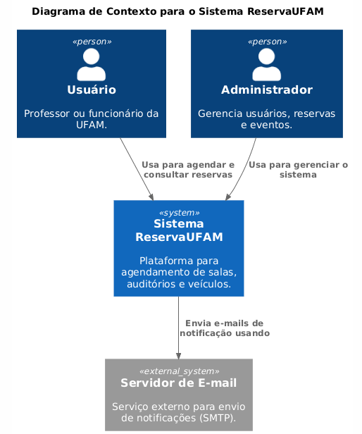
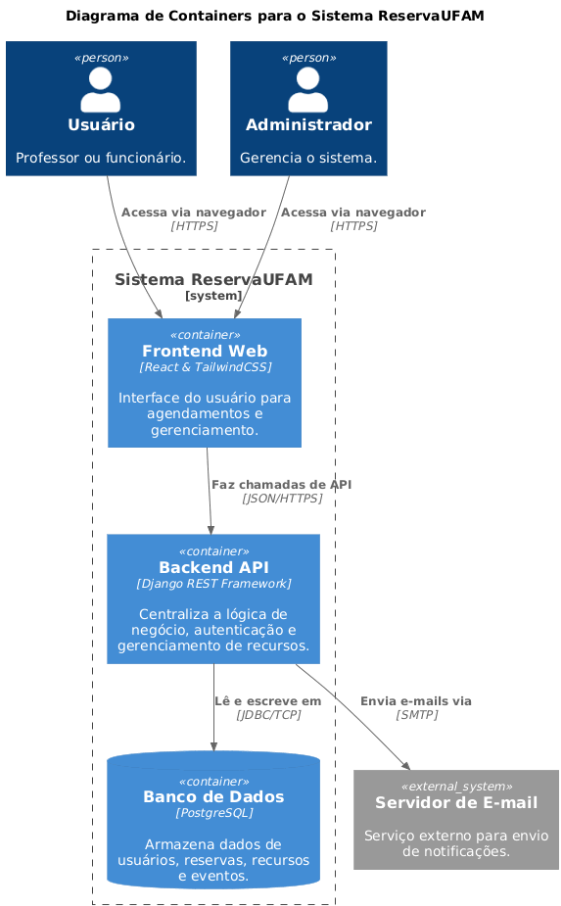
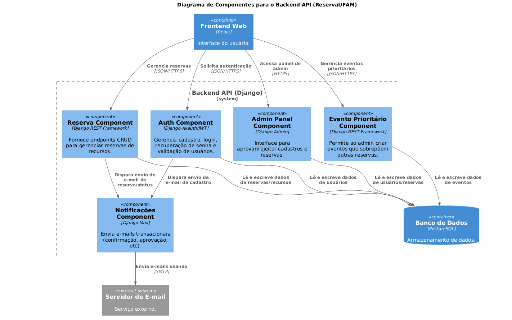

# 📚 Sistema Reservas UFAM

O sistema **Reservas UFAM** é uma aplicação web que, como o nome diz, cria e gerencia reservas de todos os recursos que a UFAM/ICET dispõe, tais como espaços físicos (salas de conferência, auditório) e veículos 🚗🏢. 

## ⚙️ Funcionalidades Principais

- 🏢 **Reserva de Recursos:** Salas, auditórios e veículos podem ser reservados por usuários autorizados.
- 📅 **Gerenciamento de Eventos:** Permite agendar atividades acadêmicas e eventos institucionais.
- 🛡️ **Autenticação de Usuários:** Login com CPF ou SIAPE, incluindo validação e aprovação administrativa.
- ✉️ **Envio de E-mails:** Confirmação de cadastro, reserva e notificações de aprovação/rejeição.
- 🖥️ **Painel Administrativo:** Administradores podem aprovar/rejeitar cadastros e reservas, criar eventos prioritários e acompanhar o calendário institucional.
- 📱 **Responsividade:** Sistema otimizado para uso em dispositivos móveis.

---

# 🗂️ Diagramas Modelo C4 do Reservas UFAM

## 📌 Diagrama de Contexto



## 📦 Diagrama de Conteiner



## 🧩 Diagrama de Componentes



---

# 🚀 Como Executar o Projeto ReservaUFAM Localmente

## 🧰 Pré-requisitos

Certifique-se de ter os seguintes softwares instalados em sua máquina:
- 🗂️ **Git**: para clonar o repositório.
- 🐳 **Docker**: para executar os containers da aplicação.
- 🐍 **Python** (recomendado 3.11): para desenvolvimento/testes do backend.
- 🟢 **Node.js** (recomendado 14): para desenvolvimento/testes do frontend.
- 📦 **npm**: gerenciador de pacotes do Node.js.
- 🐘 **PostgreSQL** (recomendado 12): banco de dados relacional.

## 🛠️ Passo a Passo

### 1️⃣ Clone o Repositório

```bash
git clone https://github.com/mericxy/ReservaUFAM.git
cd ReservaUFAM
```

### 2️⃣ Configure as Variáveis de Ambiente

Crie e configure o arquivo `.env` na raiz do projeto e no diretório do backend com as variáveis necessárias (ex: credenciais do banco, chaves de autenticação, configurações de e-mail) 🔒.

### 3️⃣ Inicie o Ambiente com Docker

Execute os containers do projeto usando o Docker Compose:

```bash
docker-compose up --build -d
```
⏳ Aguarde a inicialização dos containers.  
Caso ocorra algum erro e queira parar o ambiente:

```bash
docker-compose down -v
```

### 4️⃣ Acesse a Aplicação

- **Backend (Django):** http://localhost:8000 🛠️
- **Frontend (React):** http://localhost:5173 💻

### 5️⃣ Interaja com os Containers

Para acessar o terminal do backend ou frontend dentro dos containers:

**Django (backend):**
```bash
cd backend
docker exec -it reservaufam_backend bash
```

**React (frontend):**
```bash
cd frontend
docker exec -it reservaufam_frontend bash
```

Para sair do container:
```bash
exit
```

### 6️⃣ Banco de Dados

Certifique-se de que as configurações do banco estão corretas no `.env` e que o serviço está rodando. O PostgreSQL será iniciado automaticamente pelo Docker Compose se configurado 🐘.

### 7️⃣ Outras Dependências

O projeto possui dependências listadas nos arquivos:
- `backend/requirements.txt` (para Python/Django)
- `frontend/package.json` (para Node.js/React)

> Para instalar manualmente (fora dos containers), execute:
>
> **Backend:**
> ```bash
> pip install -r backend/requirements.txt
> ```
> **Frontend:**
> ```bash
> cd frontend
> npm install
> ```

---

## ℹ️ Observações

- O projeto é totalmente containerizado, então não é necessário instalar manualmente as dependências se você utilizar Docker.
- Recomenda-se rodar a aplicação em ambiente Linux ou WSL para evitar problemas de compatibilidade com Docker.
- Em caso de dúvidas, consulte o README do projeto para mais detalhes.

✨ Pronto! Agora é só começar a usar o ReservaUFAM! ✨
