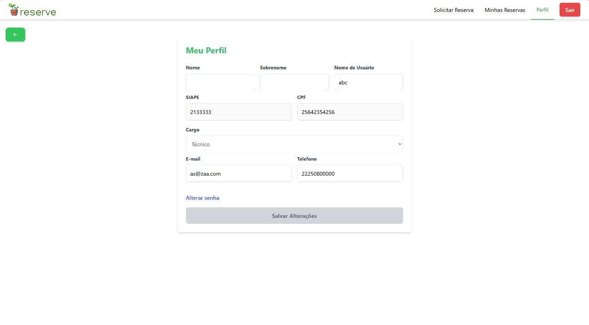
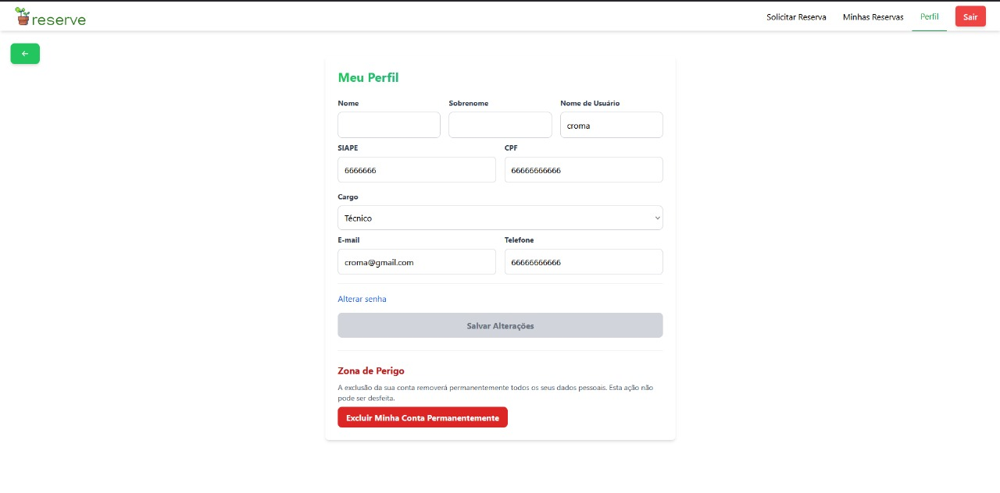
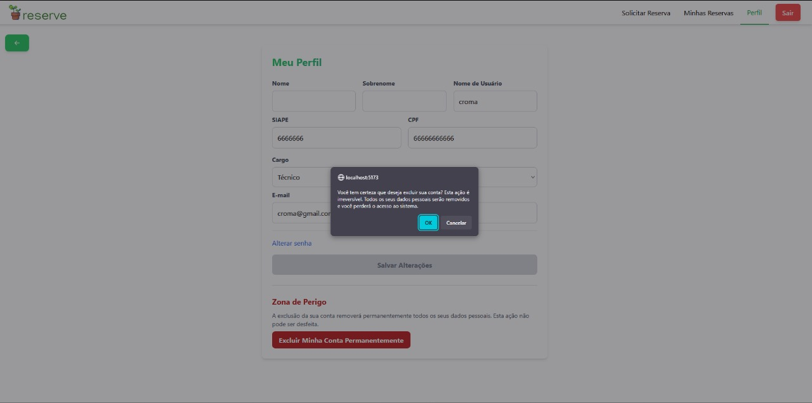

# Relatório de Funcionalidade: Exclusão de Conta (LGPD)

**Data:** 01 de Outubro de 2025
**Referência:** Manutenção Adaptativa - Adequação do Sistema à LGPD

## 1. Breve Descrição do Sistema

O projeto consiste em um sistema de gerenciamento de reservas de recursos para a Universidade Federal do Amazonas (UFAM), com um backend em Django REST Framework e um frontend em React. A autenticação é gerenciada via tokens JWT.

## 2. Funcionalidade Implementada

| Funcionalidade | Classificação | Descrição |
| :--- | :--- | :--- |
| **Exclusão de Conta e Anonimização de Dados** | Manutenção Adaptativa / Requisito Legal (LGPD) | Implementa o "direito ao esquecimento" (Art. 18, VI da LGPD), permitindo que usuários solicitem a exclusão permanente de seus dados pessoais. A estratégia de anonimização foi utilizada para preservar a integridade de dados históricos (reservas) sem a identificação pessoal do titular. |

## 3. Links para Issues Correspondentes

- **Issue #15:** Implementar funcionalidade de exclusão completa de conta e anonimização de dados.
  - *Link:* `https://github.com/users/mericxy/projects/5?pane=issue&itemId=131502287&issue=mericxy%7CReservaUFAM%7C15`

## 4. Links para Pull Requests (PRs)

- **PR para Issue #15:** Implementa a funcionalidade de exclusão de conta (LGPD).
  - *Link:* `https://github.com/mericxy/ReservaUFAM/pull/19`

## 5. Evidências dos Testes de Validação

A validação da funcionalidade foi realizada através dos seguintes cenários de teste:

### Teste 1: Comparativo da Interface (Antes e Depois)

**Evidência (Visual):**

> **[ANTES DA IMPLEMENTAÇÃO]**
> A imagem captura a tela de "Meu Perfil" do usuário antes da alteração. A página continha apenas os campos de edição e o botão para salvar.
> 

> **[DEPOIS DA IMPLEMENTAÇÃO]**
> A imagem captura a mesma tela após a implementação, agora exibindo a seção "Zona de Perigo" com o botão "Excluir Minha Conta Permanentemente".
> 
> 
> Ao clicar no botão, um diálogo de confirmação do navegador (`window.confirm`) é exibido.
> 

**Descrição:**
As evidências visuais demonstram a adição da nova funcionalidade na interface do usuário. O comparativo "Antes e Depois" mostra claramente a implementação da "Zona de Perigo" e do fluxo de confirmação, que não existiam previamente, garantindo que a ação de exclusão seja intencional e não acidental.

### Teste 2: Confirmação da Anonimização no Backend

**Evidência (Textual - Resposta da API e Estado do Banco de Dados):**
1.  **Requisição do Frontend (Após confirmação):**
    ```http
    DELETE /api/user/delete/ HTTP/1.1
    Host: 127.0.0.1:8000
    Authorization: Bearer <token_jwt_do_usuario>
    ```
2.  **Resposta do Backend:**
    ```http
    HTTP/1.1 204 No Content
    ```
3.  **Estado do Usuário no Banco (Após a ação):**
    ```json
    {
        "id": 5,
        "username": "anon_5",
        "email": "anon_5@deleted.user",
        "first_name": "Usuário",
        "last_name": "Removido",
        "is_active": false,
        "is_anonymized": true
    }
    ```

**Descrição:**
A evidência textual demonstra o sucesso do processo de anonimização no backend. A requisição `DELETE` é processada com sucesso (`204 No Content`), e a consulta ao estado do usuário no banco de dados comprova que seus dados de identificação pessoal foram permanentemente sobrescritos com valores anônimos, cumprindo os requisitos da LGPD.