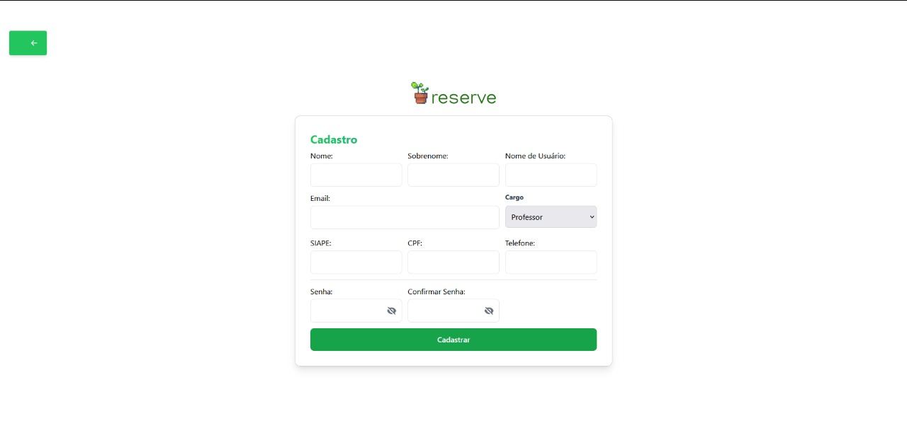
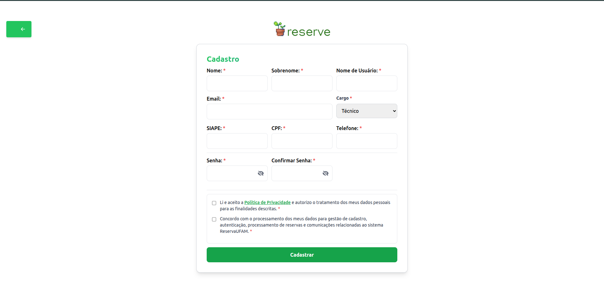

# Relatório de Funcionalidade: Políticas de privacidade (LGPD)

**Data:** 01 de Outubro de 2025
**Referência:** Manutenção Adaptativa - Adequação do Sistema à LGPD

## 1. Breve Descrição do Sistema

O projeto consiste em um sistema de gerenciamento de reservas de recursos para a Universidade Federal do Amazonas (UFAM), com um backend em Django REST Framework e um frontend em React. A autenticação é gerenciada via tokens JWT.

## 2. Funcionalidade Implementada

| Funcionalidade | Classificação | Descrição |
| :--- | :--- | :--- |
| **Políticas de privacidade** | Manutenção Adaptativa / Requisito Legal (LGPD) | Implementa a Lei Geral de Proteção de Dados (LGPD) que é a lei brasileira (Lei nº 13.709/2018) que regula o tratamento de dados pessoais para proteger a privacidade e os direitos fundamentais dos cidadãos, estabelecendo princípios como transparência e segurança, e definindo regras para a coleta, uso, armazenamento e compartilhamento de informações pessoais por pessoas físicas e jurídicas. A política de privacidade é o documento que informa o titular sobre como a empresa, organização ou governo trata seus dados pessoais, detalhando as finalidades, a base legal e os direitos do usuário. |

## 3. Evidências dos Testes de Validação

A validação da funcionalidade foi realizada através dos seguintes cenários de teste:

### Teste 1: Comparativo da Interface (Antes e Depois)

**Evidência (Visual):**

> **[ANTES DA IMPLEMENTAÇÃO]**
> A imagem captura a tela de "Cadastro" do usuário antes da alteração. A página não tinha a opção de políticas de privacidade.
> 

> **[DEPOIS DA IMPLEMENTAÇÃO]**
> A imagem captura a mesma tela após a implementação, agora exibindo a seção De Políticas de Privacidade.
> 
> 

