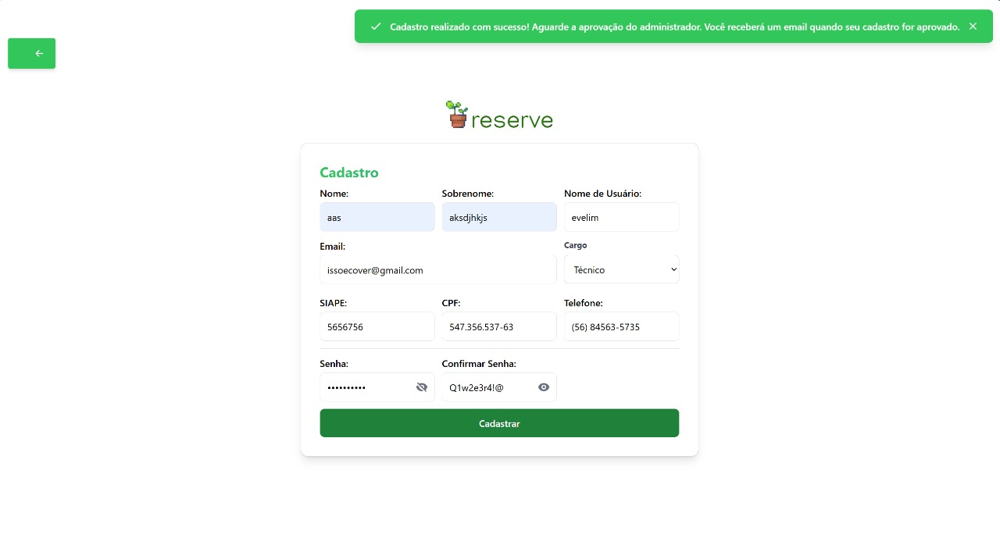
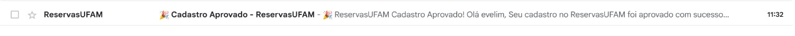
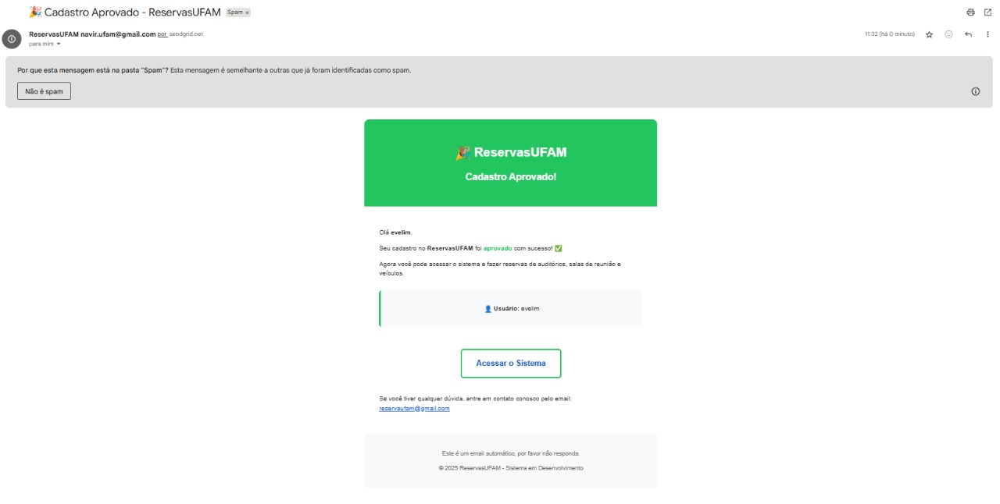

# Relatório de Funcionalidade: Notificações por E-mail (SendGrid)

**Data:** 01 de Outubro de 2025
**Referência:** Manutenção Adaptativa - Integração de API Externa de E-mail

## 1. Breve Descrição do Sistema

O projeto consiste em um sistema de gerenciamento de reservas de recursos para a Universidade Federal do Amazonas (UFAM), com um backend em Django REST Framework e um frontend em React. A autenticação é gerenciada via tokens JWT.

## 2. Funcionalidade Implementada

| Funcionalidade | Classificação | Descrição |
| :--- | :--- | :--- |
| **Integração de E-mail para Notificação de Status** | Manutenção Adaptativa / Funcionalidade | Implementa o envio automático de e-mails transacionais para os usuários quando seus status de cadastro são alterados para "Aprovado" ou "Reprovado". A integração utiliza a API externa do SendGrid e é configurável via variáveis de ambiente. Durante a implementação, foi também corrigido um bug crítico onde uma `view` duplicada (`UpdateUserStatusView`) impedia o envio de e-mails, consolidando a lógica em um único fluxo funcional. |

## 3. Links para Issues Correspondentes

- **Issue #20:** Integração de API externa de e-mail para notificações de aprovação/reprovação de usuários.
  - *Link:* `https://github.com/users/mericxy/projects/5/views/1?pane=issue&itemId=131640694&issue=mericxy%7CReservaUFAM%7C20`

## 4. Links para Pull Requests (PRs)

- **PR #22:** Integração do serviço de e-mail com SendGrid no backend.
  - *Link:* `https://github.com/mericxy/ReservaUFAM/pull/22`

## 5. Evidências dos Testes de Validação (Textuais)

A validação da funcionalidade foi realizada através dos seguintes cenários, conforme os critérios de aceite da issue.

### Teste 1: Fluxo de Aprovação de Usuário

**Evidência (Textual - Resposta da API e Conteúdo do E-mail):**
1.  **Ação do Administrador:** Um usuário com status "Pendente" é alterado para "Aprovado" através do painel.
2.  **Resposta da API (`PATCH /api/admin/users/:id/status/`):**
    ```json
    {
        "message": "Status do usuário alterado para Aprovado. E-mail de notificação enviado com sucesso."
    }
    ```
3.  **Conteúdo do E-mail Recebido:**
    > **[CONTEÚDO DO E-MAIL DE APROVAÇÃO]**
    > **Assunto:** Sua conta no ReservaUFAM foi aprovada!
    >
    > **Corpo:** Olá, [Nome do Usuário]. Sua conta foi aprovada. Acesse o sistema através do link: [Link para a página de login]


**Descrição:**
A evidência comprova que, ao aprovar um usuário, a API retorna uma mensagem de sucesso indicando o envio do e-mail. O conteúdo do e-mail recebido atende aos critérios de aceite, confirmando o fluxo.

### Teste 2: Fluxo de Reprovação de Usuário

**Evidência (Textual - Resposta da API e Conteúdo do E-mail):**
1.  **Ação do Administrador:** Um usuário "Pendente" é alterado para "Reprovado".
2.  **Resposta da API (`PATCH /api/admin/users/:id/status/`):**
    ```json
    {
        "message": "Status do usuário alterado para Reprovado. E-mail de notificação enviado com sucesso."
    }
    ```
3.  **Conteúdo do E-mail Recebido:**
    > **[CONTEÚDO DO E-MAIL DE REPROVAÇÃO]**
    > **Assunto:** Atualização sobre sua conta no ReservaUFAM
    >
    > **Corpo:** Olá, [Nome do Usuário]. Informamos que seu cadastro não foi aprovado. Motivo: [Motivo opcional].

**Descrição:**
A evidência demonstra o correto funcionamento do fluxo de reprovação, com a API confirmando o envio e o e-mail informando o usuário sobre a decisão.

### Teste 3: Validação do Serviço de E-mail com Script Manual

**Evidência (Textual - Saída do Terminal):**
1.  **Ação:** O script `reserve/test_email.py` é executado no ambiente de desenvolvimento com as variáveis de ambiente configuradas.
2.  **Saída do Terminal (Simulada):**
    ```
    [INFO] Attempting to send a test email to destinatario@example.com...
    [INFO] Test email sent successfully! API Response Status Code: 202 Accepted.
    ```

**Descrição:**
A evidência mostra que o `EmailService` e a integração direta com a API do SendGrid estão funcionando corretamente, de forma isolada da lógica das `views`, validando a configuração das dependências e variáveis de ambiente.

### Teste 4: Simulação de Falha no Envio e Resiliência do Sistema

**Evidência (Textual - Resposta da API e Log do Servidor):**
1.  **Cenário:** A variável `SENDGRID_API_KEY` é configurada com um valor inválido.
2.  **Ação do Administrador:** Um usuário é aprovado no painel.
3.  **Resposta da API:**
    ```json
    {
        "message": "Status do usuário alterado para Aprovado, mas houve uma falha no envio do e-mail de notificação."
    }
    ```
4.  **Log do Servidor Backend (Simulado):**
    ```
    [ERROR] EmailService: Failed to send approval email to usuario@email.com. Status Code: 401. Reason: Authentication error.
    ```

**Descrição:**
Este teste valida a resiliência do sistema. A ação principal (alteração de status) é concluída, mas a API retorna uma mensagem mista informando ao administrador que a notificação falhou. O log de erro no servidor fornece detalhes para depuração.

---
## 6. Evidências Visuais Adicionais
### Evidência 6.1: Tela de cadastro do usuário
**Evidência (Visual):**


### Evidência 6.2: E-mail de Aprovação Recebido pelo Usuário

**Evidência (Visual):**



**Descrição:**
Esta evidência visual confirma o resultado final do fluxo para o usuário. O e-mail de notificação é recebido corretamente na caixa de entrada, com o assunto e conteúdo esperados, validando que o `EmailService` e os templates de e-mail funcionaram de ponta a ponta.